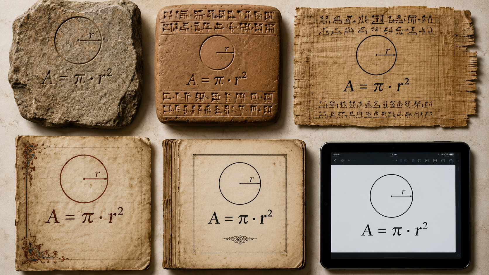

<!--
author:    André Dietrich
version:   0.1.0
language:  de
narrator:  Deutsch Male
edit:      true
comment:   Nullius in Verba — Ein 5-Minuten-Lightning-Talk über reaktive OER
           und epistemische Transparenz mit LiaScript.
import:    https://raw.githubusercontent.com/liaTemplates/MicroBit-Simulator/main/README.md
           https://raw.githubusercontent.com/LiaTemplates/Wikimedia/0.0.2/README.md
-->

# Nullius in Verba — Traue nicht dem Autoren

    --{{0}}--
Hallo, ich bin ein HeyGen-Avatar von André Dietrich, der einen Lightning-Talk vom letzten HackathOERn in Göttingen nochmal wiedergibt — direkt kombiniert mit den Kommentaren, also der Sprachausgabe in LiaScript. Glaubst du mir nicht? Klick auf „Weiter" …
!?[▶️](assets/vid/1_0.mp4)

[<!-- style="border: 2px solid black" -->](https://edu-sharing-network.org/projekt-hackathoern/)

    --{{1}}--
Klick nochmal weiter …
!?[▶️](assets/vid/1_1.mp4)

    --{{2}}--
Und jetzt zurück …
!?[▶️](assets/vid/1_2.mp4)


## Seit der Steinzeit …

    --{{0}}--
Dokumente und Lehrmaterialien sind so alt wie die Menschheit. Und man kann mit Fug und Recht behaupten, dass sie sich seit Jahrtausenden kaum verändert haben.
!?[▶️](assets/vid/2_0.mp4)



    --{{1}}--
Gleicher Inhalt. Gleiche Form. Überall. Immer. Das Medium hat sich geändert — aber nicht die Art und Weise, wie wir damit interagieren. Du siehst es — aber du kannst es nicht fassen. PDFs lassen sich leicht teilen und vervielfältigen, die Druckerpresse ist verschwunden — aber sie sind immer noch so starr wie die Steintafeln von vor über 5.000 Jahren.
!?[▶️](assets/vid/2_1.mp4)

      {{1}}
> **Ein Dokument schaut dich an.**
> 
> Du kannst es nicht hinterfragen. Du kannst es nicht verändern.
> Es weiß immer mehr als du.

## Interaktivität

    --{{0}}--
Mithilfe von Computern oder sogar einfachen Browsern können wir Lernende doch endlich zum echten Verstehen und Experimentieren einladen — oder?
!?[▶️](assets/vid/3_0.mp4)

<!-- style="width: 100%"-->

### Interaktivität == Quiz

    --{{0}}--
Jetzt kommt das große Aber. Digitale Lehrmaterialien sind oft genau das: statischer Text, PDFs und Videos — durch die sich der Lernende quält — und am Ende wartet ein Quiz. Das nennen wir dann interaktiv.
!?[▶️](assets/vid/4_0.mp4)

__Für was steht das Kürzel OER?__

- [( )] Online Experience Renderer
- [( )] Openly Editable Repository
- [(X)] Open Educational Resources
- [( )] Optimized E-Reading System

    --{{1}}--
Richtig angeklickt — aber verstanden? Der Inhalt bleibt derselbe, egal ob du die Antwort weißt oder geraten hast. Die Box ist gesetzt. Das Dokument schaut dich an.
!?[▶️](assets/vid/4_1.mp4)

      {{1}}
> Lesen. Klicken. Weiter.
> 
> **Checkbox gesetzt. Alles klar?**

### Interaktivität == Code

    --{{0}}--
Das andere Extrem sind Notebooks — Code, der wirklich ausgeführt wird. Das ist mächtig. Aber Inhalt und Code sind zwei getrennte Welten auf einer Seite.
!?[▶️](assets/vid/5_0.mp4)

``` python
from microbit import *
import music

music.play(['f', 'a', 'c', 'e'], wait=False)
display.scroll("Hello HackOERthon 2026", wait=False)
print("OER is still not interactive ... why")
```
@microbit

    --{{1}}--
Du liest — Code unterbricht. Du führst aus — du verlierst den Faden. Text erklärt, Code rechnet. Aber sie sprechen nicht miteinander.
!?[▶️](assets/vid/5_1.mp4)

      {{1}}
> **Text ist Text. Code ist Code.**
> 
> Getrennte Welten — auch wenn sie auf derselben Seite stehen.

## Formeln sind stumm

    --{{0}}--
Stell dir vor, du willst verstehen, wie viel CO₂ ein Baum bindet. Hier ist die Antwort — die Formel der Photosynthese:
!?[▶️](assets/vid/6_0.mp4)

$$6\, CO_2 + 6\, H_2O \xrightarrow{\text{Licht}} C_6H_{12}O_6 + 6\, O_2$$

    --{{1}}--
Schön. Korrekt. Und völlig stumm. Wie viele Bäume brauche ich, um meine Autofahrten zu kompensieren? Die Formel antwortet nicht. Sie schaut dich an.
!?[▶️](assets/vid/6_1.mp4)

      {{1}}
> Statische Dokumente stellen keine Fragen.
> 
> **Sie beantworten auch keine.**

### Bret Victor hatte eine Idee

    --{{0}}--
2013 hat Bret Victor gezeigt, wie Dokumente aussehen könnten — sein System heißt [„Explorable Explanations"](https://worrydream.com/ExplorableExplanations/), die in jeder Hinsicht zum Experimentieren und Ausprobieren einladen. Jedes Ding kann vom Lernenden manipuliert werden, jede Interaktion hat Auswirkungen auf andere Bereiche des Dokuments.
!?[▶️](assets/vid/7_0.mp4)

!?[Bret Victor — Media for Thinking the Unthinkable](https://youtu.be/oUaOucZRlmE?si=Fdklwx1DRoEt87WG&start=1016 "Bret Victor — Media for Thinking the Unthinkable (2013)")

    --{{1}}--
In LiaScript ist das Wirklichkeit. Heute. Für alle. Open Source. Und die Präsentation, die du gerade siehst — das ist selbst ein LiaScript-Dokument.
!?[▶️](assets/vid/7_1.mp4)

      {{1}}
> 🔗 [liascript.github.io](https://liascript.github.io)

### Java- LiaScript

    --{{0}}--
Explorable Explanations nutzt [Tangle](https://worrydream.com/Tangle/) — eine JavaScript-Bibliothek, die immer noch mit HTML und CSS kombiniert werden muss. Im Grunde ist das ein Antipattern: Irgendwo im Head des Dokuments werden JavaScript-Dateien eingebunden, die von außen mit der Seite interagieren, Events abfangen, Inhalte verändern. Ein Freund von mir hat das mal treffend beschrieben: die allwissende außerirdische Spinne. Man weiß nicht, welcher Teil des Codes für welche Änderung zuständig war...
!?[▶️](assets/vid/8_0.mp4)

    --{{1}}--
In LiaScript haben wir die Idee übernommen — aber nicht die Implementierung. Skripte stehen direkt im Dokument, genau dort, wo die Berechnung stattfindet. Das Ergebnis ist sofort sichtbar — als Text, als HTML oder als LiaScript.
!?[▶️](assets/vid/8_1.mp4)

      {{1}}
``` html
Russia started its invasion of Ukraine
<script format="relativetime" unit="day">
// Define the start date of the invasion
const invasionStartDate = new Date('2022-02-24');

// Get the current date
const currentDate = new Date();

// Calculate the difference in milliseconds
const differenceInMs = currentDate - invasionStartDate;

// Convert milliseconds to days
const differenceInDays = differenceInMs / (1000 * 60 * 60 * 24);

// Calculate the number of full days
const daysSinceInvasion = Math.floor(differenceInDays);

-daysSinceInvasion
</script>.
```
    --{{2}}--
Mehr noch: Skripte lassen sich direkt mit Eingaben verknüpfen, die eine Neuberechnung auslösen — und mit anderen Skripten verketten. So entstehen genau die komplexen Interaktionen, die Bret Victor vorgeschlagen hat. Wie sieht das aus?
!?[▶️](assets/vid/8_2.mp4)

### 🌳 Wieviel CO₂ binden Bäume?

    --{{0}}--
Schaut her — ein reaktives Dokument. Die dynamisch erzeugten Elemente sind farblich hinterlegt. Die, die zusätzlich einen Rahmen haben, sind mit einem Input verknüpft — aktivierbar durch einfaches Anklicken.
!?[▶️](assets/vid/9_0.mp4)

     {{|>}}
Eine Stadt beschließt,
<script input="range" value="10" min="1" max="10000" step="10" output="Bäume">@input</script>
Bäume zu pflanzen, um ihren CO₂-Fußabdruck zu kompensieren. Eine durchschnittliche Autofahrt in Deutschland beträgt ca.
<script input="number" value="400" min="1" max="1000" output="Autofahrt">@input</script> km.
Geht man von einem durchschnittlichen
<script
  input="select"
  output="Autotyp"
  value="SUV (BMW X5)"
  options="EU Neuwagen (2023)|Kompakt-SUV (VW Tiguan)|Mittelklasse-SUV (BMW X3)|SUV (BMW X5)|E-Auto (EU-Strommix)|E-Auto (Ökostrom)"
>"@input"</script>
so beträgt der Verbrauch in etwa
<script output="Verbrauch">
switch ("@input(`Autotyp`)") {
  case "EU Neuwagen (2023)":          118; break
  case "Kompakt-SUV (VW Tiguan)":     160; break
  case "Mittelklasse-SUV (BMW X3)":   185; break
  case "SUV (BMW X5)":                225; break
  case "E-Auto (EU-Strommix)":         70; break
  case "E-Auto (Ökostrom)":             5; break
  default:                            118
}
</script> g/km. __Reicht das — oder ist Bäume pflanzen nur ein grünes Gewissen?__


<script style="display: inline-block; width: 100%">
let trees    = @input(`Bäume`)
let km       = @input(`Autofahrt`)
let g_per_km = @input(`Verbrauch`)  // g CO2/km — kommt vom Select oben

// Wie viel CO2 bindet ein Baum pro Jahr?
// Baumtyp / Kontext	                            CO₂/Jahr
// Junger Baum (1–10 Jahre)	                          1–5 kg
// Durchschnittlicher Laubbaum (mitteleuropäisch)	10–25 kg
// Schnellwüchsiger Baum (Pappel, Eukalyptus)	    20–40 kg
// Oft zitierter "Durchschnitt" in Klimakampagnen	   22 kg (häufig unkritisch übernommen)
// Konservativer wissenschaftlicher Schätzwert	    10–12 kg
let co2_per_tree = 5

let co2_per_trip = km * g_per_km / 1000  // kg CO2 pro Fahrt

let o2_per_tree = Math.round(co2_per_tree * 32 / 44)
let co2_total   = trees * co2_per_tree
let o2_total    = trees * o2_per_tree
let car_trips   = Math.round(co2_total / co2_per_trip)

let option = {
  title: {
    text: trees.toLocaleString('de') + ' Bäume — Wirkung pro Jahr',
    left: 'center'
  },
  tooltip: { trigger: 'axis' },
  grid: { top: 60, left: 90, right: 30, bottom: 50 },
  xAxis: {
    type: 'category',
    data: [
      '🟦 O₂ produziert (kg)',
      '🟩 CO₂ gebunden (kg)',
      '🚗 Fahrten à ' + km.toLocaleString('de') + ' km'
    ]
  },
  yAxis: {
    type: 'value',
    name: 'Menge'
  },
  series: [{
    type: 'bar',
    data: [
      { value: o2_total,  itemStyle: { color: '#5470c6' } },
      { value: co2_total, itemStyle: { color: '#91cc75' } },
      { value: car_trips, itemStyle: { color: '#fac858' } }
    ],
    label: {
      show: true,
      position: 'top',
      formatter: params => params.value.toLocaleString('de')
    }
  }]
}

"HTML: <lia-chart option='" + JSON.stringify(option) + "'></lia-chart>"
</script>

    --{{1}}--
Sieht gut aus, oder? Ich habe da bewusst ein pessimistisches Beispiel gewählt. 10 Bäume sind ziemlich wenig — man müsste die Anzahl erhöhen.
!?[▶️](assets/vid/9_1.mp4)

   --{{2}}--
Die Anzahl der kompensierten Fahrten ist immer noch ziemlich klein — wahrscheinlich weil eine Fahrt von 400 km innerorts einfach kein realistischer Wert ist.
!?[▶️](assets/vid/9_2.mp4)

    --{{3}}--
Andererseits ist ein SUV auch kein passendes Stadtauto — probiert es mal mit verschiedenen Modellen.
!?[▶️](assets/vid/9_3.mp4)

    --{{4}}--
Was aber, wenn meine Berechnungen und Algorithmen nicht stimmen? In LiaScript kann man mit einem einfachen Doppelklick auf das Ergebnis einer Berechnung den Inhalt — also den Code — inspizieren.
!?[▶️](assets/vid/9_4.mp4)

    --{{5}}--
In der Darstellung des Diagramms bin ich von einer sehr pessimistischen Bilanz gestartet, also nur dem gebundenen CO₂ sehr junger Bäume. Hier kann aber noch spezifiziert werden, ob es sich um ältere Bäume handelt — die Bilanz wird von Jahr zu Jahr besser — oder ob sich andere Baumarten besser eignen. Jede Veränderung führt direkt zu einer Neuberechnung der Darstellung.
!?[▶️](assets/vid/9_5.mp4)


## Nullius in verba 

    --{{0}}--
Damit müssen Zusammenhänge, die nur als statisches Bild, Tabelle oder Diagramm dargestellt werden, nicht mehr einfach geglaubt werden. Mit anderen Worten: Nicht die Autorität des Autors zählt — sondern die Möglichkeit, die dargestellten Zusammenhänge selbst anzuzweifeln, Grundannahmen zu verändern oder spielerisch zu erkunden.
!?[▶️](assets/vid/10_0.mp4)

> ___„Nullius in verba"___ — Nimm niemandes Wort dafür.
>
> -- Royal Society, London, 1660

    --{{1}}--
Und es ist genauso sinnvoll, dem Code zu misstrauen — den Analysen, den Modellen. Das haben wir durch die Code-Exploration integriert: ein Doppelklick gibt tieferen Einblick in die Methoden und Annahmen. Und wie du sehen konntest — auch ich hatte hier Fehler versteckt.
!?[▶️](assets/vid/10_1.mp4)


      {{1}}
@Wikimedia.embed(https://commons.wikimedia.org/wiki/File:Question_Everything.jpg)

